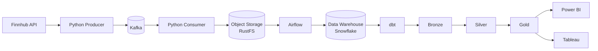

# Real-Time Stock Market Data Pipeline

An end-to-end data engineering pipeline that streams live stock quotes from a public API through Kafka, lands them in object storage, orchestrates their movement into a cloud data warehouse with Airflow, transforms them through a layered (Bronze/Silver/Gold) model with dbt, and visualizes the results in both Power BI and Tableau.

This project is a hardened, extended adaptation of the architecture demonstrated in the YouTube tutorial _"End-to-End Stock Market Data Engineering Project | Snowflake + DBT + Airflow"_ and its accompanying public repository. It follows the same core architecture while addressing a number of gaps and real-world issues the original tutorial does not cover — see [Engineering Highlights](#engineering-highlights) below.

## Overview

Every few seconds, the pipeline polls live quote data for five large-cap technology stocks (AAPL, AMZN, GOOGL, MSFT, TSLA), streams it through a message queue, lands it in object storage, and loads it into a cloud warehouse on a one-minute schedule. From there, a set of SQL transformations builds a clean, analytics-ready data model, which powers two independent dashboards.

The project is fully containerized and runs locally via Docker Compose, with no cloud infrastructure required apart from the data warehouse itself.

## Architecture



| Stage                                        | Role                                                                  |
| -------------------------------------------- | --------------------------------------------------------------------- |
| Producer                                     | Polls the quote API and publishes each reading to a Kafka topic       |
| Kafka                                        | Decouples ingestion from storage; durable, replayable message bus     |
| Consumer                                     | Reads the topic and writes each quote to object storage as JSON       |
| Object storage / RustFS                      | S3-compatible landing zone for raw data                               |
| Airflow                                      | On a schedule, moves new files from object storage into the warehouse |
| Snowflake Warehouse (Bronze → Silver → Gold) | Raw JSON is progressively cleaned and modeled via dbt                 |
| Power BI / Tableau                           | Two independent dashboards built on the Gold layer                    |

## Tech Stack

- **Language:** Python
- **Streaming:** Apache Kafka
- **Object storage:** An S3-compatible store (RustFS)
- **Orchestration:** Apache Airflow
- **Warehouse:** Snowflake
- **Transformation:** dbt
- **Visualization:** Power BI, Tableau
- **Infrastructure:** Docker / Docker Compose

## Repository Structure

```
real-time-stocks-mds/
├── docker-compose.yml
├── requirements.txt
├── producer/
│   └── producer.py
├── consumer/
│   └── consumer.py
├── airflow/
│   ├── Dockerfile
│   └── dags/
│       └── stocks_storage_to_snowflake.py
├── dbt_stocks/
│   ├── dbt_project.yml
│   ├── profiles.yml
│   └── models/
│       ├── bronze/
│       ├── silver/
│       └── gold/
└── snowflake/
    └── setup.sql
```

## Prerequisites

- Docker Desktop
- Python 3.11+
- Git
- A Snowflake account
- A free API key from [Finnhub](https://finnhub.io)
- Power BI Desktop and/or Tableau Desktop, if you want to build the dashboards

## Getting Started

1. Clone the repository and create a `.env` file in the project root (see [Configuration](#configuration) below).
2. Build and start the containerized services:
   ```
   docker compose build
   docker compose up -d
   ```
3. Create the Kafka topic the pipeline uses:
   ```
   docker exec -it stocks-kafka kafka-topics --bootstrap-server kafka:9092 --create --topic stock-quotes --partitions 3 --replication-factor 1
   ```
4. In a Python virtual environment, install dependencies and start the producer and consumer:
   ```
   python -m venv .venv
   .venv\Scripts\Activate.ps1
   pip install -r requirements.txt
   python producer\producer.py      # in one terminal
   python consumer\consumer.py      # in another
   ```
5. Run `snowflake/setup.sql` once in a Snowflake worksheet to create the warehouse, database, schema, and raw landing table.
6. Enable the `stocks_storage_to_snowflake` DAG in the Airflow UI (`http://localhost:8080`) to begin loading data on a schedule.
7. Build the dbt models:
   ```
   cd dbt_stocks
   dbt build
   ```

This is a condensed quick-start. A complete, step-by-step build guide — including troubleshooting for common environment-specific issues — is maintained separately from this README.

## Configuration

Configuration is provided via a `.env` file in the project root, which is not committed to version control. Required variables:

| Variable                                                                                                                      | Purpose                                            |
| ----------------------------------------------------------------------------------------------------------------------------- | -------------------------------------------------- |
| `FINNHUB_API_KEY`                                                                                                             | API key for the quote data source                  |
| `RUSTFS_ACCESS_KEY` / `RUSTFS_SECRET_KEY`                                                                                     | Credentials for the object storage service         |
| `AIRFLOW_ADMIN_USER` / `AIRFLOW_ADMIN_PASSWORD`                                                                               | Airflow web UI login                               |
| `AIRFLOW_UID`                                                                                                                 | Container user ID, for file-permission consistency |
| `SNOWFLAKE_ACCOUNT` / `SNOWFLAKE_USER` / `SNOWFLAKE_ROLE` / `SNOWFLAKE_WAREHOUSE` / `SNOWFLAKE_DATABASE` / `SNOWFLAKE_SCHEMA` | Snowflake connection details                       |
| `SNOWFLAKE_PASSWORD` **or** `SNOWFLAKE_PRIVATE_KEY_PATH`                                                                      | Snowflake authentication — see below               |

Snowflake accounts that authenticate via SSO/OAuth rather than a password use RSA key-pair authentication instead, since an unattended scheduled job cannot complete an interactive browser login. See the full build guide for setup instructions.

## Data Model

Data moves through three progressively refined layers, following the medallion architecture pattern:

| Layer  | Model                 | Purpose                                                                                |
| ------ | --------------------- | -------------------------------------------------------------------------------------- |
| Bronze | `bronze_stock_quotes` | Raw JSON parsed into typed columns                                                     |
| Silver | `silver_stock_quotes` | Cleaned, rounded, deduplicated quotes                                                  |
| Gold   | `gold_kpi`            | Latest price and change per symbol                                                     |
| Gold   | `gold_candlestick`    | Daily open/high/low/close per symbol                                                   |
| Gold   | `gold_treechart`      | Average price and volatility per symbol                                                |
| Gold   | `gold_rank`           | Symbol ranking by percent change over time, for leadership/momentum analysis           |
| Gold   | `gold_session_range`  | Where the current price sits within the session's high/low range                       |
| Gold   | `gold_correlation`    | Pairwise correlation of price movement across all symbols                              |
| Gold   | `gold_pair_scatter`   | Paired time-series values for a specific symbol pair, supporting scatter-plot analysis |

## Dashboards

Two independent dashboards are built on top of the Gold layer:

- **Power BI** — a functional dashboard using DirectQuery for live access to the warehouse, including KPI cards, a change-percentage chart, a volatility treemap, and a candlestick chart.
- **Tableau** — a more design-forward dashboard built around a five-symbol "pulse" concept: a hero time-series chart, a momentum bump chart, KPI cards with embedded sparklines, and an optional correlation-analysis layer.

## Engineering Highlights

A selection of the more substantial problems encountered and resolved during development:

- **Dependency failure recovery:** MinIO discontinued free Docker Community Edition images mid-project; the object storage layer was swapped to RustFS, an actively maintained S3-compatible alternative, without changing any downstream code.
- **Dual authentication paths:** added RSA key-pair authentication as an alternative to password-based login, to support Snowflake accounts that use SSO/OAuth exclusively — a necessity since an automated scheduled job cannot complete an interactive browser login the way a human user can.
- **Silent data-loss bug:** diagnosed a bug in which a warehouse file-staging step silently dropped data for three of five symbols with no error raised, caused by a filename collision between files from different symbols sharing an identical timestamp. Resolved by giving each file a globally unique name.
- **Pipeline concurrency and pagination:** identified and fixed a race condition between overlapping scheduled runs, and a pagination bug that silently capped data processing at a fixed object count, both of which caused incomplete or stale data without any visible failure.
- **TLS fingerprinting:** diagnosed an SSL failure specific to Python's default HTTP client (not present in a browser or in `curl`), caused by upstream TLS fingerprint filtering, and resolved it using a client library that replicates a real browser's TLS handshake.

## Known Limitations

- This is a near-real-time, micro-batch pipeline (data is polled, queued, and loaded on a one-minute schedule) rather than true sub-second streaming.
- dbt is currently run manually rather than as a scheduled step within the Airflow DAG.
- The Tableau dashboard, once published, reflects a snapshot of the session rather than updating live, since Tableau Public does not support a persistent live connection to an external warehouse.

## Acknowledgments

Architecture inspired by the YouTube tutorial _"End-to-End Stock Market Data Engineering Project | Snowflake + DBT + Airflow"_ and its accompanying repository, [Jay61616/real-time-stocks-mds](https://github.com/Jay61616/real-time-stocks-mds).

## License

MIT License
